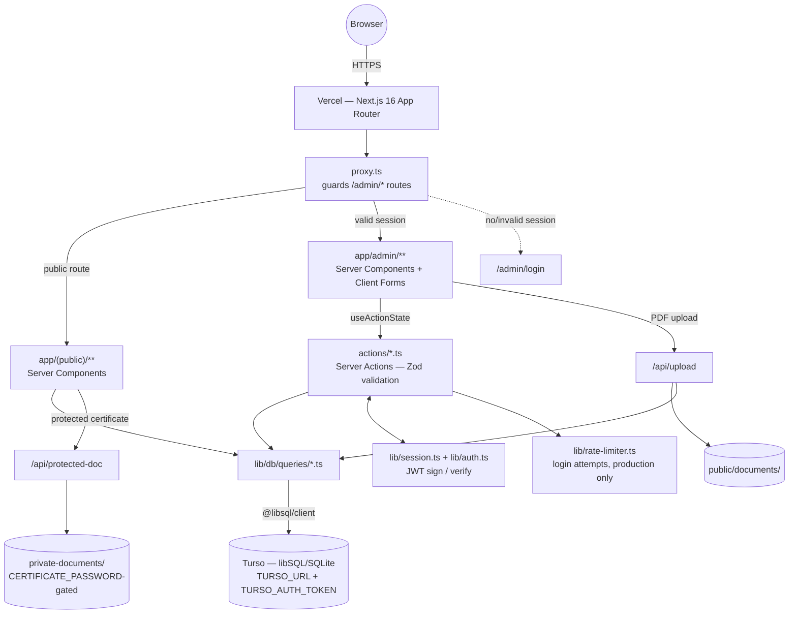

# Architecture

## System overview



One Next.js deployment on Vercel serves both the public site and the admin panel; the only branching happens in `proxy.ts`, which checks the session cookie and routes accordingly. There is no separate backend service — Server Actions and Route Handlers _are_ the backend, running as Vercel serverless functions against a remote Turso database.

---

## Request lifecycle

### Public request

`Browser → Vercel → proxy.ts (no-op for public paths) → Server Component in app/(public)/** → lib/db/queries/*.ts → Turso`

Public pages read the `lang` cookie (default `en`), fetch directly from the query layer — no Server Action indirection, since there's nothing to validate or mutate — and render server-side. No client-side data fetching exists for content; the only client interactivity is the language toggle, feedback form, and PDF upload widgets.

### Admin request

`Browser → proxy.ts (session check) → app/admin/** → Client Form (useActionState) → actions/*.ts (requireAdmin → Zod → query) → revalidatePath → Turso`

`proxy.ts` matches `/admin/:path+` and calls `getSession()`; a missing or invalid session redirects to `/admin/login`, which is explicitly excluded from the check (see [Auth](#auth) below — this is the one hand-documented gotcha in `CLAUDE.md`, since it's the classic way to build an infinite redirect loop). Every admin write additionally calls `requireAdmin()` inside the Server Action itself, not just at the proxy layer — defense in depth against a Server Action being invoked directly (Server Actions are POST-able HTTP endpoints under the hood, not just internal function calls, so the proxy check alone is not sufficient).

---

## Data layer

### Bilingual content, not an i18n framework

Every content table carries parallel `*_fi` / `*_en` columns (`lib/db/schema.sql`) rather than routing through an i18n library:

```sql
CREATE TABLE work_experience (
  ...
  company_name_fi TEXT NOT NULL,
  company_name_en TEXT NOT NULL,
  role_fi TEXT NOT NULL,
  role_en TEXT NOT NULL,
  ...
);
```

The active language is a `lang` cookie, read once per Server Component (`(cookieStore.get("lang")?.value ?? "en")`), and both columns exist for every row unconditionally — there's no "translation missing" state to handle, because the schema forces both languages to exist at write time. See [ADR-0004](./adr.md#adr-0004-model-bilingual-content-as-database-columns-not-an-i18n-library) for why this beat `next-intl` for this project's shape.

### Query layer

`lib/db/queries/*.ts` is the only code that touches `@libsql/client` directly. One file per content type (`work.ts`, `projects.ts`, `education.ts`, `courses.ts`, `skills.ts`, `recommendations.ts`, `documents.ts`, `feedback.ts`), each exporting typed `getAll*`, `get*ById`, `create*`, `update*`, `delete*` functions. `lib/db/utils.ts`'s `toArgs()` converts a plain object into libSQL's named-parameter format, which is the one piece of glue shared across every query file.

### Server Actions

`actions/*.ts` sit between the UI and the query layer and are the only place validation happens. The shape is identical across all seven content-type action files (`work.ts`, `projects.ts`, `education.ts`, `courses.ts`, `skills.ts`, `recommendations.ts`, plus `contact.ts` and `documents.ts`), which is why `lib/server-action-utils.ts` and `lib/action-utils.ts` (`validationError()`) exist — extracted once the same `requireAdmin → Zod.safeParse → query call → revalidatePath` sequence showed up in every file. `submitFeedback` in `actions/feedback.ts` is the one Server Action that skips `requireAdmin()` — it's the only unauthenticated write path in the app, which is why it gets its own scrutiny in the Security Agent checklist (`AGENTS.md`).

### Sort order

Every content table has an integer `sort_order` column, set through a plain number field in each admin form. There's no drag-and-drop reordering UI — see [ADR-0011](./adr.md#adr-0011-use-a-manual-sort_order-field-instead-of-drag-and-drop-reordering) for why that trade was made deliberately, not by omission.

---

## Auth

`lib/session.ts` signs a JWT (HS256, via `jose`) into a 7-day `session` cookie; `lib/auth.ts`'s `requireAdmin()` verifies it. `SESSION_SECRET` must be 32+ characters — the module throws **at import time** if it's shorter, so a misconfigured secret fails the build/boot rather than silently issuing a weak session.

Login (`actions/auth.ts`) compares the submitted password against `ADMIN_PASSWORD` using `crypto.timingSafeEqual` on SHA-256 hashes, not `===`, to avoid a timing side-channel on the comparison. In production only (`process.env.NODE_ENV === "production"`), `lib/rate-limiter.ts` blocks after 5 failed attempts within a 15-minute window, keyed in an in-memory `Map`. It's disabled outside production so it doesn't interfere with local dev or the E2E test suite, which logs in repeatedly across parallel workers.

---

## File handling — two storage models, deliberately different

|                  | `public/documents/`                             | `private-documents/`                                                                                                                                       |
| :--------------- | :---------------------------------------------- | :--------------------------------------------------------------------------------------------------------------------------------------------------------- |
| Access           | Anyone with the URL                             | Requires `CERTIFICATE_PASSWORD` via `/api/protected-doc` (`POST`, password in body — not a query param, to keep it out of server logs and browser history) |
| Written by       | `/api/upload` (admin-only, session-checked)     | Committed manually alongside the code                                                                                                                      |
| Git-tracked      | No — `.gitignore`'d, generated at runtime       | No — see below                                                                                                                                             |
| Intended content | CVs, work/study certificates meant to be public | Certificates the owner wants gated behind a password (e.g. containing a personal identity number)                                                          |

`private-documents/` being _outside_ git tracking is a recent, deliberate fix, not the original design: the files were committed directly to the repo for several months, which meant the `/api/protected-doc` password gate protected nothing against anyone with `git clone` access (or against GitHub, if the repo was ever public — `git log` doesn't forget). The fix was a `.gitignore` rule plus a full history rewrite (`git filter-repo`) to purge the old blobs, not just stopping future commits. The general lesson — a route-level password check is not a storage-level access control — is worth restating for whoever adds the next protected-content type.

---

## Testing architecture

Two frameworks, split by what they exercise, not by preference:

- **Vitest** (`tests/unit/`) — pure functions only: `parseTechnologies`, `technologiesField`, `toArgs`, `validationError`, session `encrypt`/`decrypt`. No server, no browser, no I/O. Fast enough to run on every save.
- **Playwright** (`tests/e2e/`) — everything that involves rendering, routing, or a Server Action round-trip. Runs against its own Next.js server on port 3001, backed by a throwaway `test.db` SQLite file that's deleted and reseeded (`tests/e2e/seed-test-db.ts`) on every run. Production Turso data is never in the loop.

`playwright.config.ts` caps concurrency at `workers: 2` — pushing it higher was tried and produced spurious admin-login failures, because the dev server and the in-memory pieces (sessions, rate limiting) don't parallelize cleanly beyond that. This is a measured constraint, not an arbitrary one.

---

## Deployment topology

```
GitHub push/PR → GitHub Actions (Build → Lint → Format check → Unit tests → E2E tests → Deploy Gate)
                                                                                    │
                                                                    (main branch only, all steps green)
                                                                                    ▼
                                                                        Vercel deploys automatically
                                                                                    │
                                                                                    ▼
                                                        Vercel serverless functions ⇄ Turso (remote libSQL, EU West)
```

CI and production deliberately use _different_ databases: CI points `TURSO_URL` at `file:./test.db` (a fresh local file) so pull requests never touch or depend on the real Turso instance; only `SESSION_SECRET` and `ADMIN_PASSWORD` are shared repository secrets, kept in sync with `.env.local` by convention (there's no automation enforcing this — see ADR-0012 in [`docs/adr.md`](./adr.md) for the env-var drift this has already caused).

---

## Related documents

- [`adr.md`](./adr.md) — why each technology and pattern above was chosen, with alternatives and trade-offs
- [`state.md`](./state.md) — a closer look at the frontend half of this diagram: Server vs. Client Components and where every kind of state lives
