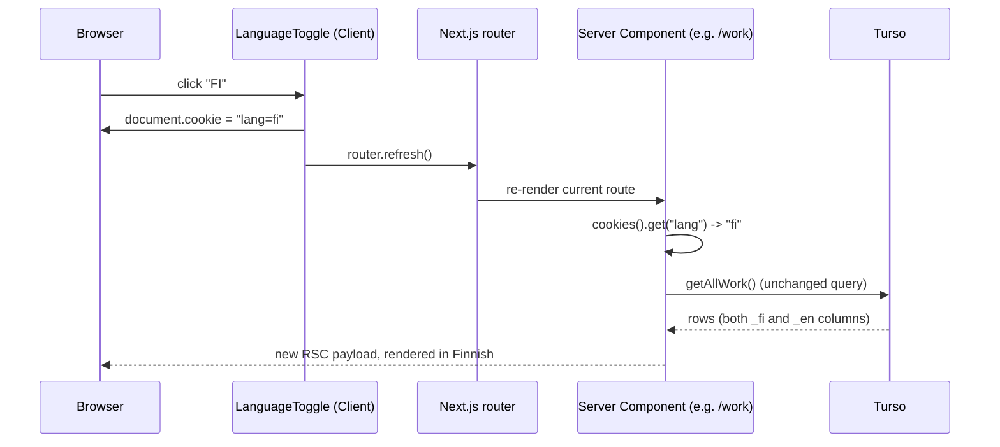

# Frontend Architecture & State

How rendering and state actually work in this codebase: what's a Server Component, what's a Client Component, where each piece of "state" lives, and why. Written by auditing the code directly (`grep` for `"use client"`, `useState`, `useActionState`, `createContext`; reading the actual build output) rather than from memory of how a typical Next.js app is put together.

**Sources used:** Next.js's own App Router documentation, read from this repo's `node_modules/next/dist/docs/` — the canonical source for this project per `AGENTS.md`'s "this is not the Next.js you know" warning, since a version this new doesn't reliably match general training data. Full Stack Open's core curriculum supplies the underlying React state vocabulary this document uses (component state, lifting state up, props as one-way data flow) — Full Stack Open's dedicated Next.js part is hosted at `courses.mooc.fi` as a client-rendered app that couldn't be fetched as static content from here, so nothing below cites its syllabus specifically; the App Router docs above are the technical ground truth instead.

---

## Rendering model: Server Components by default

Next.js's App Router renders **Server Components** by default — they run only on the server, can `await` a database call directly, and never ship their code to the browser. A component becomes a **Client Component** only when the file starts with `"use client"`, which draws a boundary: everything that file imports or renders directly becomes part of the client JavaScript bundle. ([`node_modules/next/dist/docs/01-app/01-getting-started/05-server-and-client-components.md`](../node_modules/next/dist/docs/01-app/01-getting-started/05-server-and-client-components.md))

This project follows that default closely: every `app/**/page.tsx` and `layout.tsx` is a Server Component. Data fetching happens inline — `getAllWork()`, `getWorkById(id)`, etc. — with no client-side `fetch`, no loading spinner state, no `useEffect` data-fetching anywhere in the codebase. `"use client"` is added only where a component genuinely needs interactivity, matching the docs' own guidance ("add `'use client'` to specific interactive components instead of marking large parts of your UI as Client Components").

### Every route is dynamic — a direct consequence, not a default

```
Route (app)
┌ ƒ /
├ ƒ /work
├ ƒ /work/[id]
├ ƒ /admin
└ ... (all 36 routes)

ƒ  (Dynamic)  server-rendered on demand
```

(`npm run build` output, verified for this document — every single route, including the homepage, is marked `ƒ` Dynamic. None are statically prerendered.)

This isn't accidental. Every public Server Component calls `cookies()` to read the `lang` cookie (see [State category 2](#2-locale-state-the-lang-cookie) below), and reading `cookies()` inside a Server Component tells Next.js the response depends on request-specific data — which opts the whole route out of static generation. The bilingual-via-cookie design (ADR-0004 in [`docs/adr.md`](./adr.md)) is what makes every page dynamic; a locale-in-URL approach (`/en/work`, `/fi/work`) could have kept pages statically generated per locale instead. That trade-off is already recorded in ADR-0004 — this document just makes the concrete, measured consequence (zero static pages) explicit.

---

## Client vs. Server Component inventory

26 files carry `"use client"` out of the whole `app/`, `components/`, and `lib/` tree. Grouped by why they need it:

| Reason for `"use client"`                                                                                                | Components                                                                                                                                                                     |
| :----------------------------------------------------------------------------------------------------------------------- | :----------------------------------------------------------------------------------------------------------------------------------------------------------------------------- |
| Local interactive state (`useState`)                                                                                     | `Nav` (mobile drawer), `SidebarNav` (scroll-spy active section), `DeleteButton` (confirm dialog), `ProtectedDownload` (password prompt flow), `FeedbackForm` (expand/collapse) |
| Server Action + `useActionState`                                                                                         | `app/admin/login/page.tsx`, `ContactForm`, `FeedbackForm`, and every admin `*Form.tsx` via the shared `useAdminForm` hook                                                      |
| Routing/navigation calls (`useRouter`)                                                                                   | `LanguageToggle`, `useAdminForm`                                                                                                                                               |
| `component={Link}` on a MUI component (Next.js `Link` can't cross the Server→Client boundary as a prop, see `CLAUDE.md`) | `WorkCard`, `ProjectCard`, `EducationCard`, `LinkButton`                                                                                                                       |
| MUI requires a Client Component context (theme provider, SSR emotion cache)                                              | `MuiProvider`, `mui-theme.ts`                                                                                                                                                  |
| Browser-only download/print APIs                                                                                         | `PrintButton`, `ProtectedDownload` (`fetch` + `Blob` + `URL.createObjectURL`)                                                                                                  |
| Error boundaries (`error.tsx` must be a Client Component per the App Router file convention)                             | `app/(public)/error.tsx`, `app/admin/error.tsx`                                                                                                                                |
| Simple pass-through / no server-only concern, kept client for consistency with siblings                                  | `AdminNav`, `AdminFormControls`, `CertificationsSection`                                                                                                                       |

Everything else — every `page.tsx`, every `layout.tsx`, the query layer, the Server Actions themselves — is a Server Component or plain server-only module. `lib/session.ts`, `lib/logger.ts`, and `lib/rate-limiter.ts` additionally import the `server-only` package, so importing them from a Client Component is a **build-time error**, not just a convention (see the "Preventing environment poisoning" section of the Next.js docs referenced above).

---

## The six kinds of "state" in this app

There's no Redux, Zustand, or React Context holding application data anywhere in this codebase (`grep -r "createContext\|useContext"` outside MUI's own internals returns nothing). State is instead split across six distinct mechanisms, each scoped to what actually needs it:

### 1. Persisted state — the database

The real, durable state of the application: work entries, projects, education, skills, etc. Lives in Turso, read through `lib/db/queries/*.ts`, written through `actions/*.ts`. Every Server Component that renders content re-reads this on every request (a consequence of the "every route is dynamic" point above) — there is no client-side cache of this data, no SWR/React Query, nothing kept in memory across navigations.

### 2. Locale state — the `lang` cookie

Which language is active. Deliberately **not** React state at all:

```tsx
// components/public/LanguageToggle.tsx — 'use client'
function setLang(lang: "fi" | "en") {
  document.cookie = `lang=${lang}; path=/; max-age=31536000`;
  router.refresh();
}
```

`LanguageToggle` writes the cookie directly via `document.cookie` (no Server Action involved), then calls `router.refresh()` to re-run every Server Component on the current route with the new cookie value. Every Server Component reads it independently and identically:

```ts
const lang = (cookieStore.get("lang")?.value ?? "en") as Lang;
```

No Context provider threads `lang` through the tree, and no component holds a `useState` copy of it — the cookie _is_ the state, and the server is re-asked for a fresh render whenever it changes. This is the cleanest example in the codebase of "state that looks like it needs a client store, but doesn't, because the App Router can just re-render the server tree."

### 3. Session/auth state — the `session` JWT cookie

Whether the current visitor is an authenticated admin. An `HttpOnly` cookie signed with `jose` (`lib/session.ts`), checked two ways: `proxy.ts` gates the route before any Server Component runs, and `requireAdmin()` (`lib/auth.ts`) is called again inside every Server Action as defense in depth (see [`architecture.md`](./architecture.md#request-lifecycle)). No client-side "is logged in" flag exists anywhere — the only client-visible signal is which page you're allowed to land on.

### 4. Server Action / form-submission state — `useActionState`

The result of a form submission: validation errors, a success flag, a `pending` boolean. Scoped to exactly the Client Component that owns the `<form>`, and gone the moment that component unmounts:

```ts
// lib/hooks/useAdminForm.ts — shared by every admin *Form.tsx
const [state, formAction, pending] = useActionState(action, {
  success: false,
  errors: {},
});
useEffect(() => {
  if (state?.success) router.push(redirectPath);
}, [state, router, redirectPath]);
```

This is React 19's `useActionState` exactly as documented ([`node_modules/next/dist/docs/01-app/02-guides/forms.md`](../node_modules/next/dist/docs/01-app/02-guides/forms.md)) — the Server Action's return value becomes `state`, `formAction` is what `<form action={...}>` calls, and `pending` disables the submit button mid-request. Four places use it directly or via the shared hook: `app/admin/login/page.tsx`, `ContactForm`, `FeedbackForm`, and — through `useAdminForm` — all six content-type admin forms.

### 5. Local, ephemeral UI state — plain `useState`

Interaction state that has no meaning outside a single component and is never persisted:

| Component           | `useState` fields                      | What it tracks                                                                                                      |
| :------------------ | :------------------------------------- | :------------------------------------------------------------------------------------------------------------------ |
| `Nav`               | `drawerOpen`                           | Mobile hamburger menu open/closed                                                                                   |
| `SidebarNav`        | `activeKey`                            | Which anchor section is currently scrolled into view                                                                |
| `DeleteButton`      | `open`, `pending`, `errorMessage`      | Confirmation dialog visibility + in-flight delete state                                                             |
| `ProtectedDownload` | `open`, `password`, `error`, `loading` | Password-prompt dialog for `/api/protected-doc`                                                                     |
| `FeedbackForm`      | `open`                                 | Whether the "anything unclear?" form is expanded (separate from its own `useActionState` for the submission itself) |

None of this needs to survive a navigation or a page refresh, so component-local `useState` is the correct-sized tool — reaching for Context or a global store here would be solving a problem this app doesn't have.

### 6. What's deliberately absent: URL/search-param state

No component reads `searchParams` (`grep -r "searchParams" app` returns nothing). There's no filterable/sortable list view in this app that would benefit from shareable, bookmarkable URL state — the admin lists show everything, and public lists are short enough not to need pagination or filtering. If that changes (e.g., a filterable projects list), `searchParams` is the App Router's idiomatic answer, not client state — see the `use()` and Server Component `searchParams` patterns in the same Next.js docs referenced above.

---

## Forms are uncontrolled, not controlled

Admin forms don't hold field values in `useState` at all. Inputs use `defaultValue`, not `value` + `onChange`:

```tsx
// components/admin/WorkForm.tsx
<TextField name="company_name_fi" defaultValue={defaultValues?.company_name_fi} />
```

The DOM itself is the source of truth for in-progress edits; on submit, the browser's native `FormData` collects every field and hands it to the Server Action. This is what makes the forms work without JavaScript at all (progressive enhancement) and is the pattern the Next.js forms guide recommends for exactly this reason. The cost, also noted in ADR-0008, is no client-side per-keystroke validation — errors only appear after a full round-trip through `useActionState`.

---

## One flow, end to end: toggling the language



No component in this chain holds "the current language" as its own state past the click handler — the cookie carries it, and the server does the rest. This is the same shape every other cross-cutting concern in the app follows (auth via the `session` cookie, database content via re-fetch on every render): push state to the narrowest, most durable place it can live — a cookie or the database — and let Server Components re-derive everything else from there on each request, rather than mirroring it into client memory.

---

## Related documents

- [`architecture.md`](./architecture.md) — request lifecycle, auth flow, data layer
- [`adr.md`](./adr.md) — ADR-0001 (Next.js App Router), ADR-0004 (bilingual content model), ADR-0005 (auth), ADR-0008 (Server Actions + `useActionState` over a client form library) go deeper on the _why_ behind several of the choices documented here
